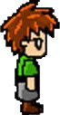

<br />

<p align="center">
    
</p>

<h2 align="center">Grey Genisys</h2>
<br />

<p align="justify">
    A tile-based platform game using the PyGame module
</p>

## Tech-stack

- Python and Pygame module

## Motivation?

- Just an idle moment

## Local setup

 **1. Clone this repo by running the following command :-**
 ```
  git clone https://github.com/GreyManuel/Platform_PyGame.git
  cd Platform_PyGame
 ```

 **2. Now install the pygame module by running the following command :-**
 ```
  pip install pygame
 ```
 **3. Now open the Plaform_Pygame directory in visual studio code and run the 13_platform_collision.py file :-**


## Author

- **Manuel Grey**
    - [LinkedIn](http://www.linkedin.com/in/manuel-grey-aa4010182) | [Gmail](mailto:greytechsystems@gmail.com)
